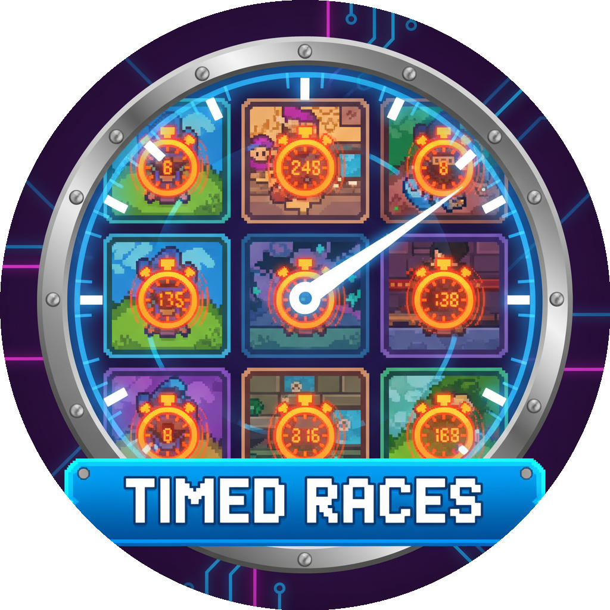

<h1 align="center">

</h1>
<h3 align="center">Convert Rogue Legends tiles into timed race minigames. Convert just minigames or ALL tiles - fully configurable! (ISAB dream).</h3>
<h1 align="center">All Minigames/Encounters are Timed Races in Rogue Legends.</h1>

